# Zombies

Adds new zombies to the game.

All zombies were created by khzmusik, using either CC0 or royalty-free assets.
See the Technical Details.

* :x: Server side only (clients do not need to install the mod)
* :heavy_check_mark: EAC safe (clients and servers do not need to disable Easy Anti-Cheat)

## New Zombies

These are the names of the new zombie entities, and a brief description of each:

* `zombieBurntKhz` - a new burnt zombie
    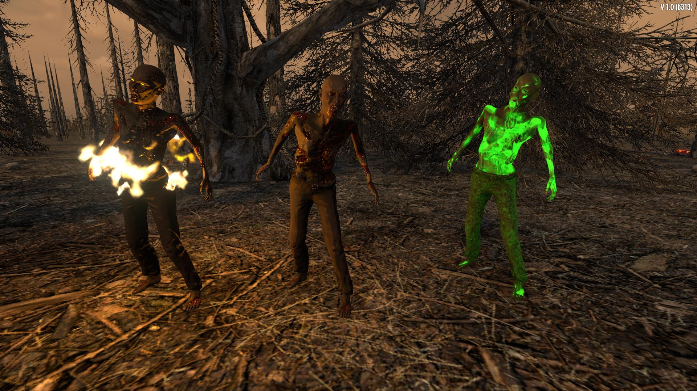
* `zombieBusinessmanKhz` - an older businessman zombie
    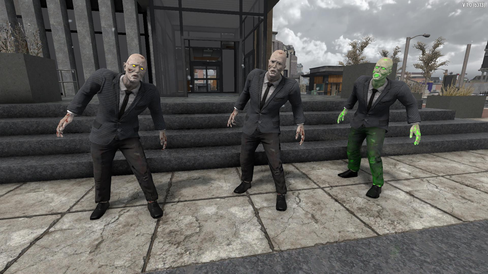
* `zombieBusinesswomanKhz` - an older businesswoman zombie
    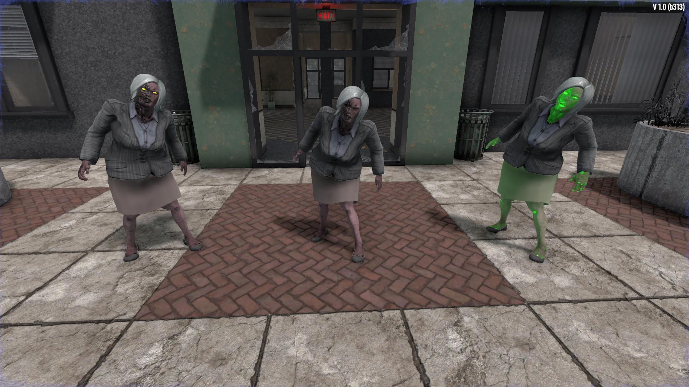
* `zombieCowgirlKhz` - a skinny cowgirl zombie
    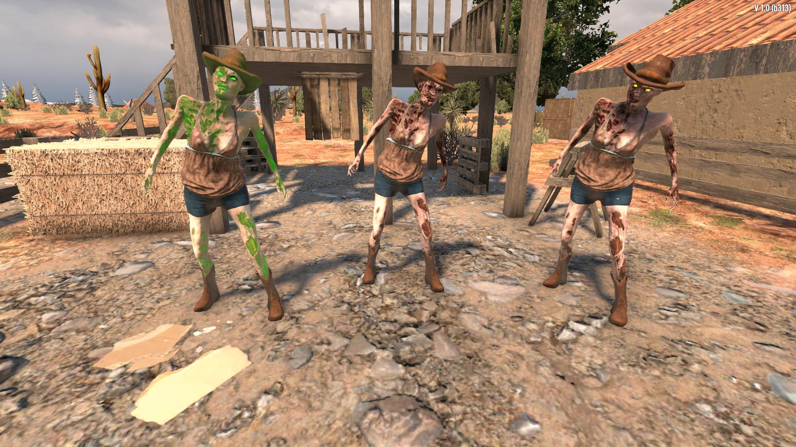
* `zombieFemaleKhz` - a generic, but skinny, female zombie
    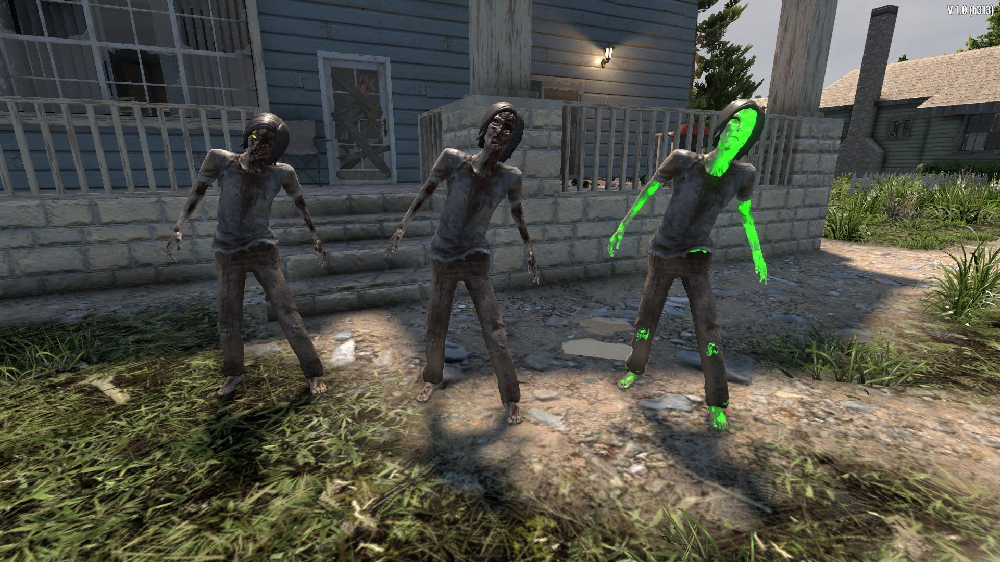
* `zombieFemaleLumberjackKhz` - a female lumberjack zombie
    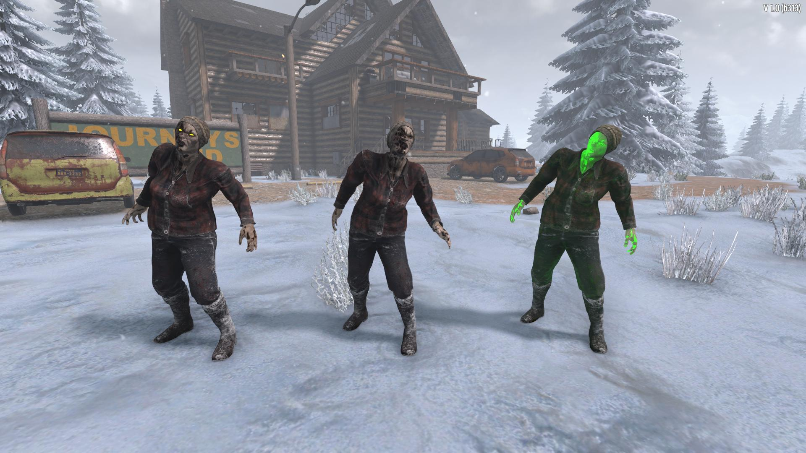
* `zombieFemaleOfficeKhz` - a female office worker zombie
    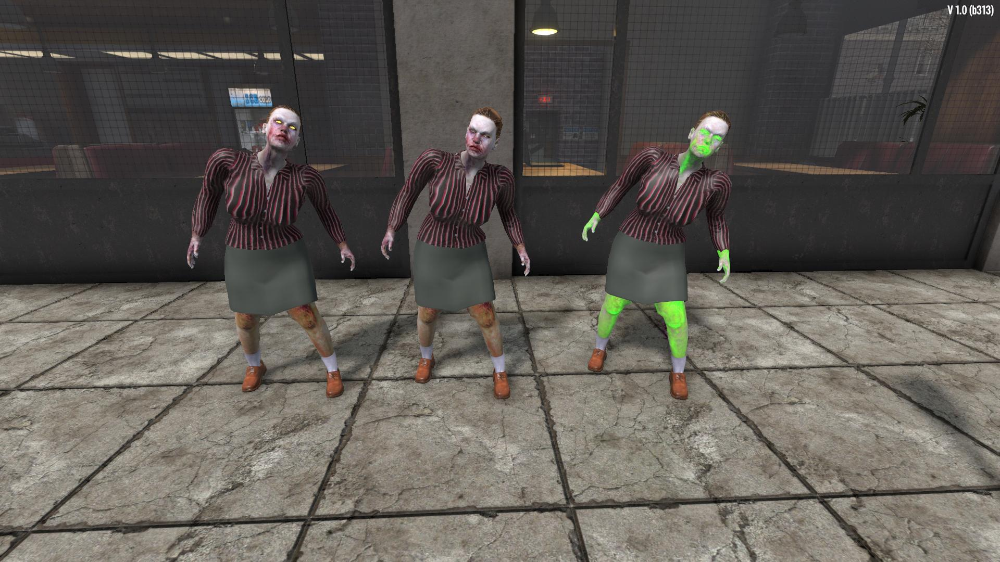
* `zombieFirefighterKhz` - a male firefighter zombie
    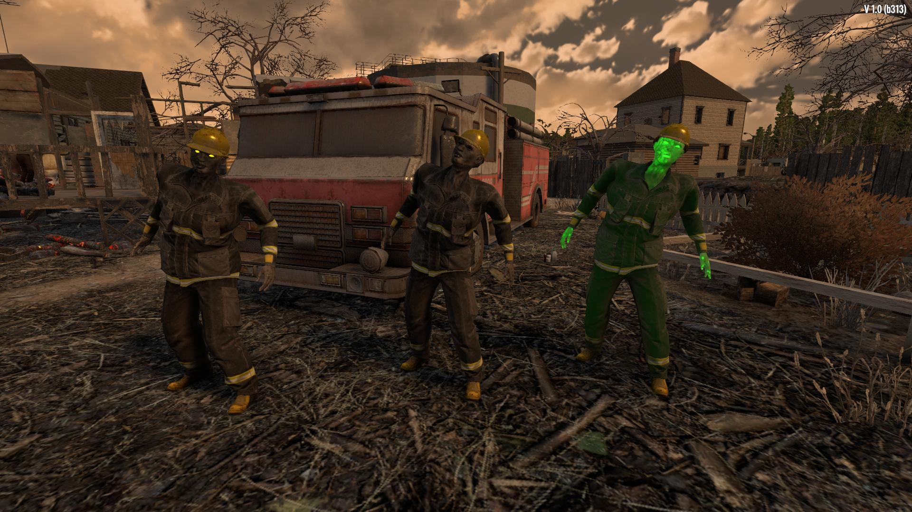
* `zombieMaleKhz` - a generic, but skinny, male zombie
    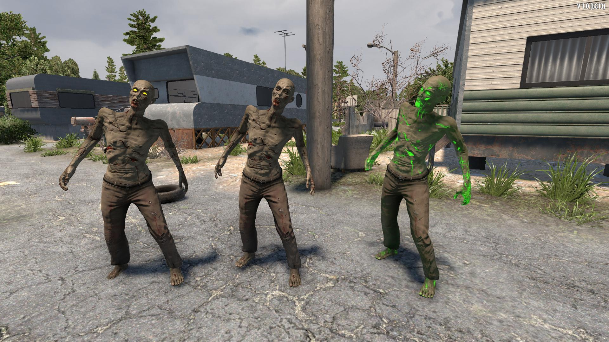
* `zombiePolicewomanKhz` - a large policewoman zombie.
    **New for 1.0:** be careful, she spits!
    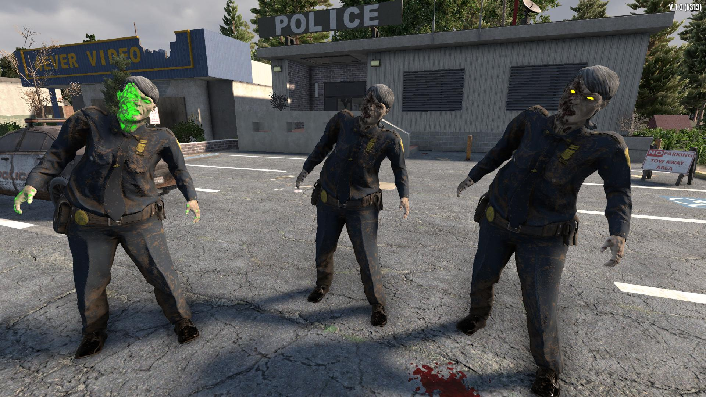
* **New for 1.0:** `zombieMaleScrubsKhz` - A male health care worker zombie in medical scrubs.
    This zombie can randomly spawn with three different colors of scrubs.
    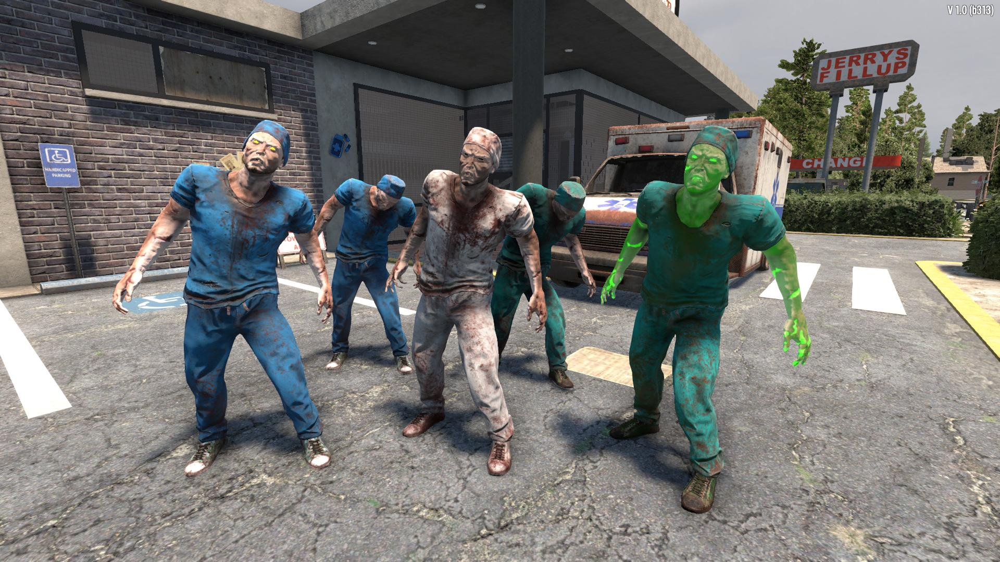
* **New for 1.0:** `zombieFemaleSoldierKhz` - A female soldier zombie.
    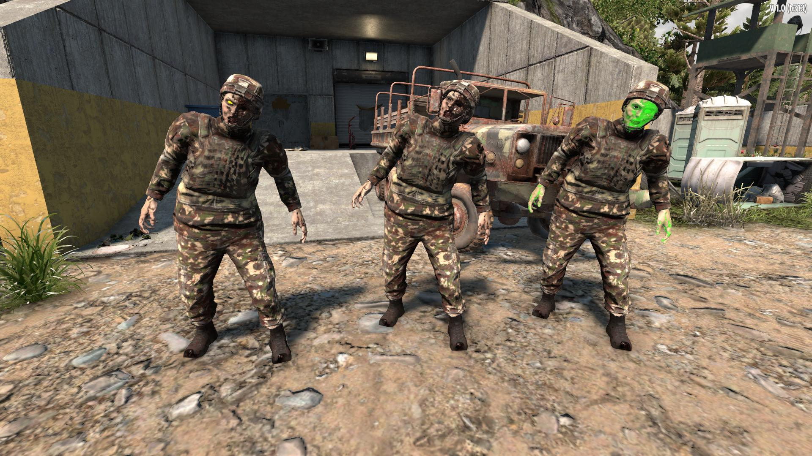
* **New for 1.0:** `zombieFemzombieMaleSoldierKhzaleSoldierKhz` - A new male soldier zombie.
    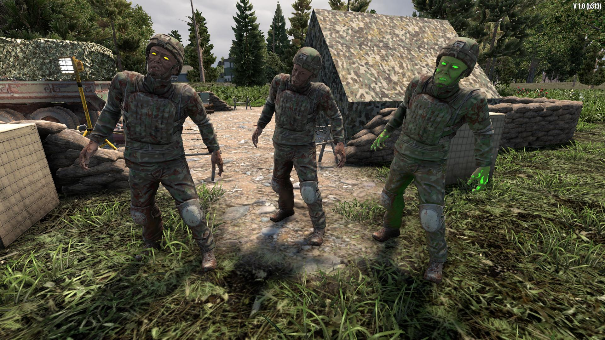

There are feral and radiated versions of each zombie.

The new zombies should spawn with the appropriate vanilla zombies.

## Technical Details

This modlet includes new non-XML resources (Unity assets).
These resources are _not_ pushed from server to client.
For this reason, this modlet should be installed on both servers and clients.

### How the zombies were created

The zombie models were created using one of two programs:

* Mixamo Fuse - a free program for making human-like characters, including zombies.
    Unfortunately, after Adobe bought it, it was discontinued and is no longer supported.
    But it can still be used, and is still very good.
* [MakeHuman](http://www.makehumancommunity.org) -
    an open source program for making human characters.
    It includes many community assets.

Once the models were created, I exported them to `.obj` files, and rigged them in
[Mixamo](https://www.mixamo.com).
From Mixamo, I exported them to Unity `.fbx` files.

I then imported them into Unity to set up ragdolls, rigging, tags, material shaders, etc.

To make the radiated materials, I made a copy of the material used for the main body.
If it wasn't already, I set it to use Unity's standard shader.
Then, I enabled "Emission," and set the color to a "neon green" color.
For the "Color" texture, I usually used the gloss map that was exported by Fuse,
though I often had to copy it and darken the sections representing clothing.

None of this would be possible were it not for the help of Xyth and Darkstardragon - thank you!

If you would like to know how to do all this yourself,
Xyth has an excellent series of tutorials on YouTube:

https://www.youtube.com/c/DavidTaylorCIO/playlists

### Re-use in other mods/modlets

Any rights that I hold in these characters, I hereby place into the public domain
([CC0](https://creativecommons.org/share-your-work/public-domain/cc0)).
Feel free to re-use them in any of your mods or modlets.

However, I don't hold the rights to all the assets in the models.
I have used assets from Mixamo Fuse and MakeHuman, and do not hold any rights in those assets.
Those rights are retained by Fuse, and/or the members of the MakeHuman community.

This sounds worse than it is.
Both the Fuse and MakeHuman assets are released under very lenient licenses,
and it should not be any problem for mod authors to include them in their mods:

* Characters created in Mixamo Fuse may be used in any game (commerical or not) for free,
    though you cannot repackage and sell the raw Fuse assets.
* MakeHuman characters can include assets from the MakeHuman team, or community assets.
    The MakeHuman assets are CC0, and the community assets are usually CC0 or CC-BY.
    In the 1.0 version of this mod, I only use assets that are CC0.

Obviously, the characters also use assets from The Fun Pimps (sounds, animations, etc).
The Fun Pimps retain the rights in those assets.

### Asset Credits

These assets were used in the creation of characters in this modlet.
The assets were created for, and used in, MakeHuman.

* **sohh Female zombie skin**  
    author:  sohh  
    license: [CC0](https://creativecommons.org/share-your-work/public-domain/cc0)
* **Zombie eyes**  
    author:  culturalibre  
    license: [CC0](https://creativecommons.org/share-your-work/public-domain/cc0)

If I have missed any assets used in these characters, please let me know,
and I will credit the author or remove the character, as appropriate.
